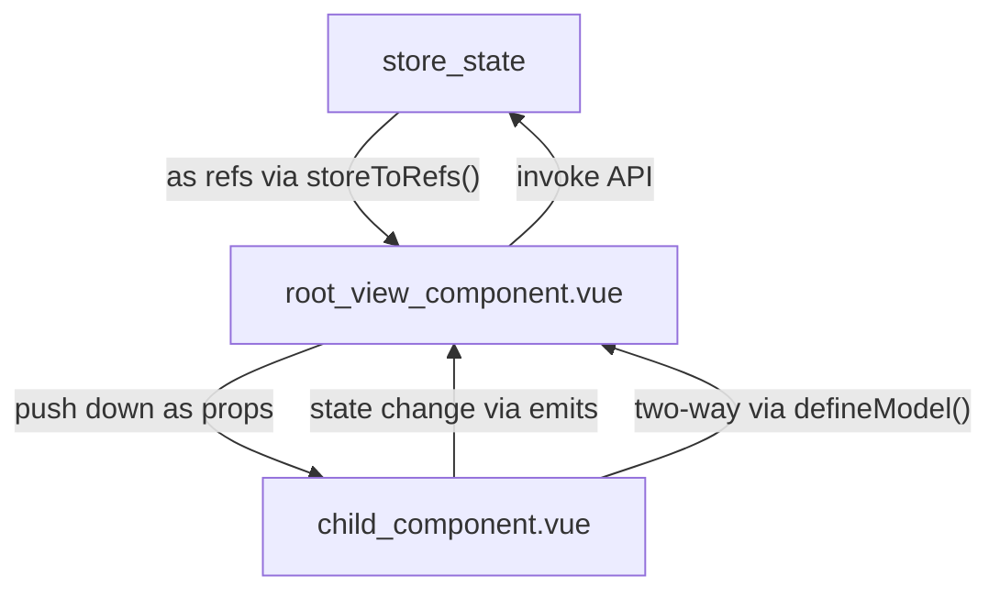
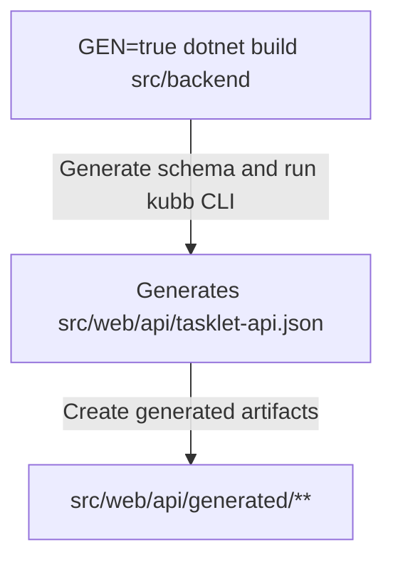

# Tasklet Frontend Vue 3 + NaiveUI and TypeScript Best Practices

## Vue 3.5 Composition API, Naive UI, Pinia (src/Web), *.vue

- The frontend of the application is located at `src/Web`
- The app uses Vue 3.5 with composition API and single file components (SFC)
- Use `watch()`, `ref()`, and `computed()` primarily
- Use Pinia for centralized store management for root level components
  - Each pinia store roughly maps to an API tag
- Use `defineModel<{...}>()` for two-way binding
- Use `defineProps<{...}>()` for typed props
- Use `defineEmits<{...}>()` for typed events
- Keep things typed for readability
- Format with Prettier
- Use `any` is bad; use `as` is bad; avoid if possible
- File naming:
  - Single function export, composables: `singleFunctionExport.ts` or `useSomeComposable.ts`
  - Many types, functions, declarations: `the-name-of-the-concept.ts`
  - Vue SFC: `SomeSingleFileComponent.vue`
  - Pinia store: `a-pinia-store.ts`

### Vue Commenting

- Comments are a BIG BRAIN 🧠 way to capture chain of thought, history, decision making, key relationships (classes, files, entities); USE IT
- Use idiomatic JSDoc comments in `*.ts` and TS script blocks in `*.vue` files; document variables, expected inputs, outputs, and notes
- Use HTML comments in Vue `<template>` to call out key components and their purpose; what does it render?  How does it behave?  What related state does it need?  What was the reason for creating it?

### Key Libraries

- Naive UI for components v2.43.2
- Vue Router (`src/web/src/router/index.ts`)
- Pinia for global state (`src/web/src/stores/**`)
- UnoCSS (`src/web/uno.config.ts`) with the following plugins
  - Wind4 preset (simulates Tailwind classes as a preset)
  - Attributify (use Tailwind classes directly as attributes)
  - Typography
  - Tagify
- Tabler icons from xicons for Vue `import { FileCheck } from "@vicons/tabler";`
  - Use icons: `<NButton><template #icon><NIcon :component="FileCheck" /></template></NButton>`
- VueUse

### Key Vite Config Info

- Project is configured to use `AutoImport` (`src/web/vite.config.ts`)
  - unplugin-auto-import/vite
  - unplugin-vue-components/vite
  - unplugin-vue-router/vite
- `@` is aliased to `./src` (`src/web/src`)

## Structuring Components

- Structure components in folders with a "root" view component under `src/web/src/views/my-root-component`
- The root view component is the only one that should interact with Pinia stores
- Create child components and propagate state down as `props` to the child components
- Handle events that require the stores at the root view component; emit from the child
- Keep view related components together in a folder
- Only put reusable components in `src/web/src/components`

<vue_component_hierarchy>

```html
<!-- EXAMPLE: ./src/web/src/views/example/RootComponent.vue -->
<template>
  <!-- (Comment with purpose of this component) -->
  <ChildComponent1
    :store-state-a // Compact format when prop matches ref
    @some-emit="handleCallToStore"
  />

  <!-- (Comment with purpose of this component) -->
  <ChildComponent2
    v-model="twoWayState"
    :store-state-b
    @another-emit="handleAnotherAction"
  />
</template>

<script setup lang="ts">
import { storeToRefs } from "pinia";
import { useSomeStore } from "@/stores/some-store";
import ChildComponent1 from "./ChildComponent1.vue";
import ChildComponent2 from "./ChildComponent2.vue";

// Consume store here at the root
const someStore = useSomeStore()

const {
  storeStateA,
  storeStateB,
  twoWayState
} = storeToRefs(someStore);

/**
* Comment describing the purpose of this callback handler, why it exists
*/
async function handleCallToStore() {
  // Use store here at the root, not at the child
}

async function handleAnotherAction(theParam: string) { ... }
</script>

<!-- EXAMPLE: ./src/web/src/views/example/ChildComponent2.vue -->
<template>
  <!-- Two way binding via defineModel -->
  <NButton @click="twoWayBound = !twoWayBound"/>...</NButton>
  <!-- Emit and handle store interaction at the root -->
  <NButton @click="emits('anotherEmit', storeStateB)">...</NButton>
</template>

<script setup lang="ts">
const twoWayBound = defineModel<bool>({
  required: true
})

const props = defineProps<{
  storeStateB: string
}>()

const emits = defineEmits<{
  anotherEmit: [theParam: string]
}>()
</script>
```

</vue_component_hierarchy>



### Typical Component

- `canonical_vue_component` shows a typical layout for a component
- Use `PascalCased` component names

<canonical_vue_component_template>

```html
<template>
  <!--
  (Template first) Explain the purpose of this component
  -->
  <NCard>
    ...
    <NButton @click="emits('someEmittedEvent', ...)">

    </NButton>
    <NInput v-model:value="enteredText">

    </NInput>

    <!-- Use comments to call out large section -->
    <NCard>
      <template #header>
        <!-- Example of UnoCSS Wind4 preset using Attributify (mt-4) -->
        <span mt-4></span>
      </template>
    </NCard>
  </NCard>
</template>

<script setup lang="ts">
// (Script second)
import ...

// Models (if applicable) for two-way binding scenarios
const twoWayState = defineModel<string>({
  required: true
})

// Props
const props = defineProps<{
  prop1: string;
  prop2: string;
}>()

// Emits
const emits = defineEmits<{
  someEmittedEvent: [param1: string, param2: bool];
  anotherEmittedEvent: []; // No params
}>

// Refs
const enteredText = ref<string>("");

// Computed
const upperCasedText = computed(() => enteredText.value.toUpperCase());

// Watch
watch (...);

// Functions
async function handleSomeUserEvent() {
}

</script>
```

</canonical_vue_component_template>

### Component Handling Both Create and Edit

- When a component handles create or edit of a model, use local form `ref`s to manage binding
- For a new instance, set the form `ref` to defaults
- For an existing instance, `watch` the prop and set the form `ref` to the prop values

<vue_create_or_edit_component>

```html
<script setup lang="ts">
const props = defineProps<{
  someEntity: SomeEntity
}>()

// Updates are handled at the root-component.vue
const emits = defineEmits<{
  addEntity: [newEntity: SomeEntity];
  updateEntity: [id: string, name: string, description: string]; // Properties needed for update
}>()

const name = ref("");
const description = ref("");
// Other values

/**
* What is it watching for and why?  What mutations occur here?
*/
watch(
  () => props.someEntity,
  (entity) => {
    name.value = !!entity ? entity.name : "";
    description.value = !!entity ? entity.description : "";
    // Other values
  }
);
</script>
```

</vue_create_or_edit_component>

## `src/web/src/components/SidePanel.vue`

- Used for displaying additional data and forms for editing

<side_panel_component>

```html
<template>
  <SidePanel v-model="showPanel" title="Confirm and Save" :width="1024">
    <template #default>
      <!-- Displays full height panel on right side -->
    </template>
    <!-- Other templates: header, footer, action -->
  </SidePanel>
</template>
<script setup lang="ts">
// Two way bind so the parent can control visibility
const showPanel = defineModel<boolean>({
  required: true
})
</script>
```

</side_panel_component>

### Generated API Library

- API generation uses Kubb.dev
- **Always prefer** the generated clients and types in `src/web/src/api/generated`
- **Avoid direct `fetch`** except for cases where the API is not exposed over OpenAPI (e.g. SSE endpoints)
- OpenAPI spec generation starts by building the .NET web API to create a new schema `GEN=true dotnet build src/backend --no-restore --nologo`
  - This **automatically** rebuilds the OpenAPI spec as well and regenerates the clients and types
- Output target: `src/web/api/generated`; **DO NOT** edit these files directly because they will be overwritten on rebuild
- If you need to affect the generated types or clients, modify the `src/web/kubb.config.ts` and use `yarn --cwd src/web generate` to only regenerate with new config
- OpenAPI input schema: `src/web/api/tasklet-api.json`
- Kubb generation outputs static root classes following the group name of the route in the Minimal API.
  - C# minimal API `.WithTags("Repository")` generates `Repistory.someApiCall(...)`
  - See @dotnet-csharp-expert-guidance.md
  - Import from `@/api/generated`



### Styling and UnoCSS + Wind4 Preset

- When possible, prefer to use UnoCSS with Wind4 presets via Attributify
- Only use `<style scoped></style>` when needed
  - Need to use `:deep` to access child component styles
  - Wind4 with Attributify would not achieve the desired visual
  - It would be easier/cleaner to do it with CSS rather than a large number of attributes

<unocss_wind4_attributify_example>

```html
<!-- Using class -->
<div class="m-2 rounded text-teal-400" />

<!-- Using Attributify -->
<div m-2 rounded text-teal-400 />
```

</unocss_wind4_attributify_example>

### Good Practices to Follow

- Put global application-level state into the `src/web/src/stores/app-store.ts`
- Put feature-specific state into its own Pinia store
- Stores should only be accessed from root view components (or other stores) and props pushed down to child components (land-and-expand management of state)
- Break up the root view component into smaller child components; compose the view
- Use `defineModel` when two-way binding is needed from a child component to a root view component
- You can define multiple `defineModel` if needed
- Mind the Vue order (template, script [imports, defineModel, defineProps, defineEmits, refs, computed, watch, functions],
- Stores can reference other stores as needed
- Pull out reusable code into composables; you can pass in `Ref<T>` into the composable if needed and return `refs` as well
- **Prefer native NaiveUI defaults for styling**
  - Use UnoCSS Wind4 presets *sparingly* when needed
  - Use **Wind4 attributes with Attributify** (`<SomeTag font-800>`) rather than `class="font-800"`
- Use the Playwright MCP to check how the UI looks
- Use idiomatic JSDoc and HTML comments to make it easier to review the code later
  - Document reasoning and chain of thought; to-the-point and **concise**
  - Convey key design decisions
- `const storedRef = useLocalStorage("some-key", "default")` for state that will be useful if page is refreshed or browser is closed
  - Only non-sensitive information like preferences, last used, etc.
- Instead of passing down callback functions, use `defineEmits` and `emits` the event to the parent.  This is idiomatic in Vue.
- Vertical whitespace (newline) free; make code easy read for human by separating ideas
  - Single line declarations: can be dense; no vertical whitepace
  - Multi-line declaration: vertical whitespace probably good!
  - Variable declaration transition to function call or conditional logic: newline good!
  - Function call transition to function call: newline good!
  - Component declaration in template:
    - Small component to small component: no vertical whitespace
    - Big component to big component: newline good!
    - Small component to big component: newline good! (Add comment <!-- (What big component do) -->, too!)

<vertical_spacing_in_vue_and_typescript>

```typescript
// Keep together
const activationFilterRows = ref<ActivationFilterRow[]>([]);
const copiedAgentDrafts = ref<CopiedAgentDraft[]>([]);
const agentFormSnapshot = ref("");

// Two types of declarations; add whitespace:
const pendingSave = ref(false);
const pendingCopiedAgentDraftId = ref<string | null>(null);

let nextActivationFilterRowId = 1;
let nextCopiedAgentDraftId = 1;

// Two types of concerns; add white space
type CreateFormDraft = {
  form: AgentForm;
  activationFilterRows: ActivationFilterRow[];
};

const createFormDraft = ref<CreateFormDraft | null>(null);

// Multiline declaration; add whitespace for visual separation
const formSnapshot = computed(() =>
  serializeAgentForm(form.value, activationFilterConfiguration.value),
);

const agentFormDirty = computed(
  () => formSnapshot.value !== agentFormSnapshot.value,
);

```

</vertical_spacing_in_vue_and_typescript>

### Bad Practices to Avoid

- Never use `someRef.value` in the `<template></template>` doesn't work; don't do it
- Avoid creating very large components; break it up into more digestible sub-components (not too deep)
- Never directly access stores from child-level components; push down via props or use `defineModel` for two-way interactions
- Never pass down callbacks in props; use emit instead. This is Vue, NOT React.  Evan You frowns on this.
- Do not use `fetch` directly unless it is an API route that is not reflected in the OpenAPI schema

## TypeScript Best Practices

- Use for `*.ts` files like stores, services, composables, and TS in `*.vue` files
- Prefer `for-of` loops over `.forEach` for better async/await support and readability
- Prefer explicit type specification as this makes the code SAFER and easier to read for all of us
  - `any` and `as` type coercion is dangerous; avoid!
- File naming conventions for FE:
  - Exports one main function: `useTheFunctionNameHere.ts`
  - Exports multiple functions, types, declarations: `name-the-related-concept.ts`
  - A Pinia store: `a-pinia-store.ts`

### TypeScript Commenting

Commenting is a BIG BRAIN 🧠 way to leave notes, key decisions, and history in the code itself.  USE IT.

- Applies to: `*.ts`, TypeScript in `*.vue`
- Use idiomatic JSDoc comments:
  - `@param {type} name - Description`
  - `@return {type} Describe the return value`
  - Use other common tags to help make the code easier to read
- Use a concise summary first
  - Then add brief descriptions to capture chain-of-thought, business context, and flow
- Use inline comments as necessary to add clarity; be direct and to-the-point
- Skip comments when the code is very obvious and brief
- Comment detail and depth correlates with complexity of code and logic; add more comments if the code is complex or part of a complex flow; call out related files if the flow spans multiple files

### Good TypeScript Practices to Follow

- Exported functions, classes, types should always have block comments describing the purpose and design for the function
  - Focus on the "why" and how it interacts with other parts of the system
  - Document parameters and return types
  - This will make the code more maintainable and provide context when you need it again later
  - Use inline callouts where it adds clarity to complex code
- **Always** brace statements like `if (...) { }`; do not use `if` without braces!
